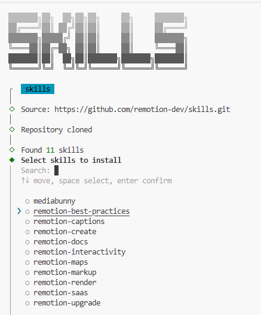
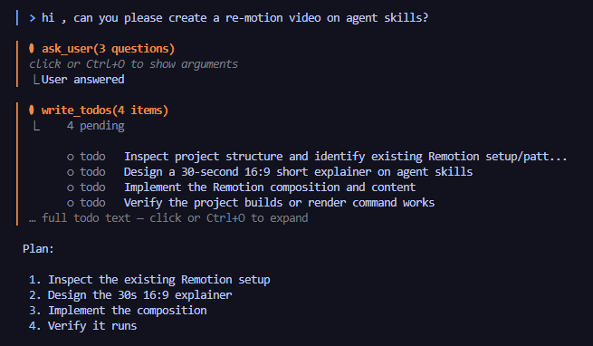

This contains information about Deep agents

Steps:
1. Intiaitilize UV using uv init
2. Create virtual environment
3. Run  uv tool install 'deepagents-cli[ollama.groq] . This installs 2 executatbles , deepsagents, deepagents cli
4. Setup OPenAI API Key in environment variable
5. Run uv add  deepagents-code. This will install the necessary tool and allows us to run the deepagents cli
6. run deepagents-code . This wiill open the CLI as below

7. Add npx-skills using uv add npx-skills  
8. Add a open source to create a video using the react. uvx npx-skills add remotion-dev/skill
9. Select the skill to install

10. Select the agnets or CLI . Just hit "Enter" without any selection
11. Install to Project or Global based on the preference. 
12. Select to proceed with the installation and complete the steps
13. Run the commant in the cli hi , can you please create a re-motion video on agent skills? and continue with the options

