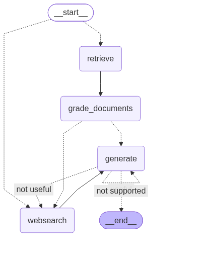
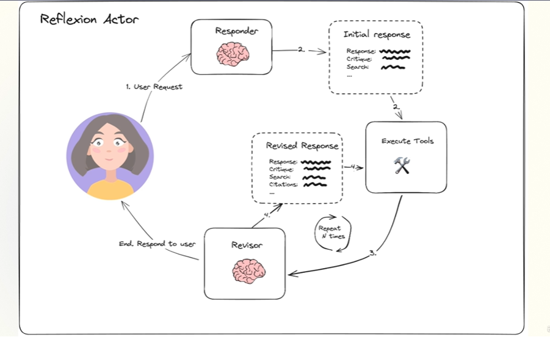

# Adaptive RAG

A simple Adaptive Retrieval-Augmented Generation (RAG) demo built with LangChain-style graph logic.

This repository shows how a question can be routed to either a local vector store or a web search, how retrieved documents are graded for relevance, and how answer generation is validated for grounding and usefulness.

## What this project contains

- `main.py`: startup script that loads the graph and runs a sample query.
- `ingestion.py`: loads external web documents, splits them into chunks, and can build a local Chroma vector store.
- `graph/graph.py`: defines the adaptive workflow and compilation of the state graph.
- `graph/nodes/`: pipeline steps for retrieval, generation, relevance grading, and web search.
- `graph/chains/`: LLM prompt chains for routing, generation, and grading.

## Dependencies

This project targets Python 3.14 or newer.

Install dependencies using the local project metadata in `pyproject.toml`:

```powershell
python -m pip install --upgrade pip
python -m pip install -e .
```

## Environment variables

Create a `.env` file in the project root with the following keys:

```text
OPENAI_API_KEY=your_openai_api_key
TAVILY_API_KEY=your_tavily_api_key
```

Optional tracing variables can be added if you want LangSmith tracing:

```text
LANGSMITH_TRACING=true
LANGSMITH_ENDPOINT=https://apac.api.smith.langchain.com
LANGSMITH_API_KEY=your_langsmith_api_key
```

## Step-by-step setup

1. Open a terminal in the repository root: `c:\Technical\Github-Tech\langchain-course`
2. Create a Python virtual environment:

```powershell
python -m venv .venv
.\.venv\Scripts\Activate.ps1
```

3. Install dependencies:

```powershell
python -m pip install --upgrade pip
python -m pip install -e .
```

4. Create `.env` and add your API keys.

5. Populate the local Chroma vector store:

   - Open `ingestion.py`.
   - Uncomment the `Chroma.from_documents(...)` block.
   - Run:

```powershell
python ingestion.py
```

   This will load the configured URLs, split the text into chunks, and persist the vector store under `./.chroma`.

6. Run the example app:

```powershell
python main.py
```

   The script prints a greeting and invokes the compiled graph on the sample question `agent memory?`.

## How the workflow works

1. `graph/graph.py` builds an adaptive state graph using `langgraph.StateGraph`.
2. The router in `graph/chains/router.py` decides whether to use:
   - `vectorstore` retrieval, or
   - web search.
3. `graph/nodes/retrieve.py` fetches documents from the local Chroma retriever.
4. `graph/nodes/grade_documents.py` grades retrieved documents for relevance.
   - If any document is not relevant, the workflow may trigger web search.
5. `graph/nodes/generate.py` generates an answer from relevant context.
6. `graph/chains/hallucination_grader.py` checks whether the generation is grounded in the retrieved facts.
7. `graph/chains/answer_grader.py` ensures the generated answer addresses the original question.
8. If generation is not grounded or not useful, the graph can fall back to web search.

## Running tests

Run the repository tests with:

```powershell
pytest
```

## Customization and extension

- Add or change source documents in `ingestion.py` by editing the `urls` list.
- Adjust routing behavior in `graph/chains/router.py`.
- Modify grading or generation prompts in `graph/chains/*.py`.
- Add new graph nodes under `graph/nodes/`.

## Troubleshooting

- If `python main.py` fails because Chroma cannot load persisted data, make sure `./.chroma` exists and that `ingestion.py` has built the vector store.
- If web search fails, confirm `TAVILY_API_KEY` is set in `.env`.
- If OpenAI calls fail, confirm `OPENAI_API_KEY` is set and valid.
- If you want to refresh the vector store after changing sources, rerun `python ingestion.py`.

## Notes

- The graph generates `graph.png` automatically when `graph/graph.py` is imported, showing the workflow structure.
- `main.py` currently runs a sample query and prints the workflow result for quick verification.

---

This README is designed to be self-contained and to let a developer follow the repository setup and run the project end-to-end.


Flow Diagrams

